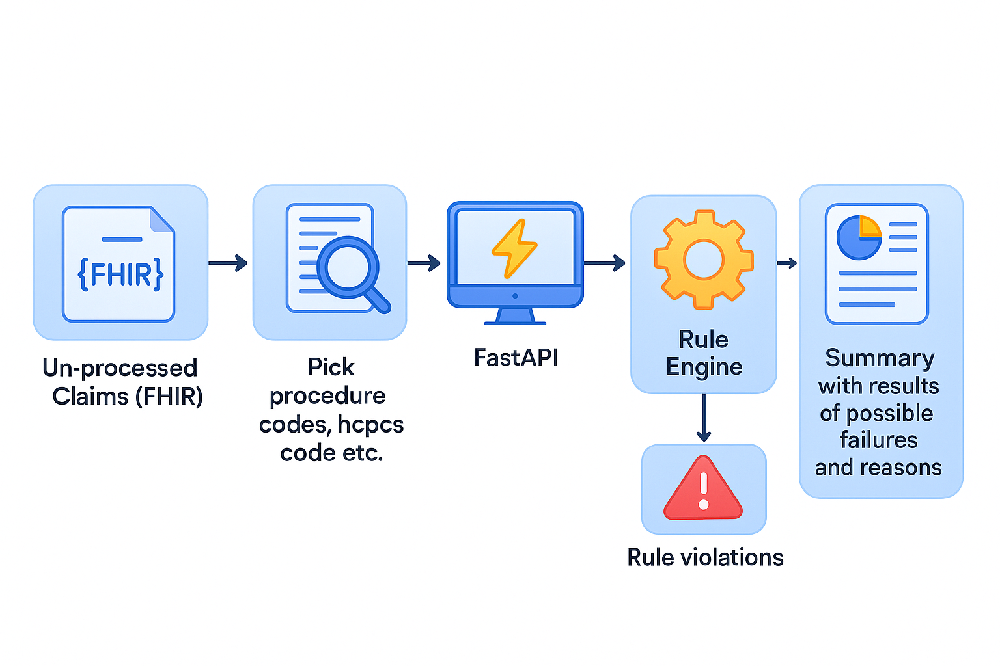

# ClaimsGuard.ai

This [project](https://devpost.com/software/claimguardians) was developed and presented for [Commure Codes](https://commure-codes.devpost.com/) 

## Overview

ClaimsGuard.ai is a React-based web application designed to streamline the process of validating medical claim codes. The application allows users to input claim data in JSON format, parse and validate the claims, and receive instant feedback on the validation results.



## Features

- **JSON Input**: Enter claim data directly in JSON format with syntax highlighting
- **Claim Preview**: View parsed claims in a clean table format before submission
- **Validation Results**: Review claim validation outcomes with detailed approval status
- **Code Compatibility**: Validate procedure codes, modifiers, and their compatibility
- **Responsive Design**: Works seamlessly across desktop and mobile devices

## Application Flow

1. **Input Claims Data**: Enter JSON-formatted claim data in the left panel
2. **Parse Claims**: Click "Parse Claims" to validate the format and structure
3. **Preview Claims**: Review the parsed claims in the table preview
4. **Submit Claims**: Click "Submit All" to validate all claims or submit individual claims
5. **View Results**: See validation results with approval status and detailed feedback

## Tech Stack

- **React**: Front-end UI library
- **Redux Toolkit**: State management
- **Axios**: API communication
- **PapaParse**: CSV parsing (for file upload feature)

## Architecture

The application follows a component-based architecture with Redux for state management:

### Key Components

- **ClaimInput**: Handles JSON input and file uploads
- **ClaimTableDisplay**: Displays parsed claims for preview
- **ClaimResults**: Container for displaying validation results
- **ValidationResults**: Shows status and statistics of validated claims

### Redux Store

- **claimSlice**: Manages claim data, processing, and validation state
- **parseSlice**: Handles raw data parsing and transformation

### API Communication

The application communicates with a backend validation service via RESTful API endpoints:
- `/validate/batch`: Validates multiple claims
- `/validate/single`: Validates individual claims

## Setup and Installation

### Prerequisites

- Node.js (v14+)
- npm
- Internet connection for API access

### Installation Steps

1. Clone the repository
   ```
   git clone https://github.com/shra012/Commure-Hackathon.git
   cd medclaim-validation
   ```

2. Install dependencies
   ```
   npm install
   ```
   or

3. Configure API endpoint (if needed)
   - Open `src/utils/api.js`
   - Update the `API_BASE_URL` constant to point to your validation service

4. Start the development server
   ```
   npm start
   ```

5. Access the application
   - Open your browser and navigate to `http://localhost:3000`

## Usage Example

### Sample JSON Input

```json
[
  {
    "claim_id": "C1",
    "codes": ["0001A", "0591T"],
    "modifier": "1"
  },
  {
    "claim_id": "C2",
    "codes": ["90460", "90461"],
    "modifier": "0"
  }
]
```

### Expected Output

After validation, the system will display results indicating whether each claim is approved or requires adjustments, along with detailed compatibility information for the submitted procedure codes and modifiers.

## Troubleshooting

### Common Issues

1. **API Connection Errors**
   - Verify the API endpoint in `api.js`
   - Check network connectivity
   - Ensure CORS is properly configured on the server

2. **Invalid JSON Format**
   - Validate your JSON structure
   - Ensure arrays are properly formatted
   - Check for missing commas or brackets

3. **Empty Validation Results**
   - Confirm the API service is responding
   - Check browser console for errors
   - Verify the format of your claim data matches API expectations

# Backend

A **FastAPI** service for validating CPT/NCCI code pairings in healthcare claims using:

- **ChromaDB** + vector embeddings for “pair‑to‑pair” rule lookup  
- One‑time duplication checks (patient has already billed a HCPCS code)  
- **Groq AI** for generating concise, factual summaries of violations  

---

## 📦 Project Structure

```
backend/
├── Dockerfile
├── requirements.txt
├── start.sh
├── claim_history.json      ← past‑claims lookup  
├── ncci_rules.json         ← NCCI/PTP rule definitions  
├── sample_claim.json       ← example claim payload  
└── src/
    ├── datastore.py        ← load rules, embeddings, ChromaDB interface  
    ├── rule_validation.py  ← ValidationRule classes & orchestrator  
    ├── genai.py            ← Groq AI summarization logic  
    └── main.py             ← FastAPI app & routing  
```

---

## 🛠️ Prerequisites

- Python 3.11+  
- Docker & Docker Compose (optional, for containerized deployment)  
- (Optional) GPU with CUDA for faster embedding generation  

---

## 🚀 Quickstart

### 1. Build & run with Docker

```bash
# Build the backend image
docker build -t commure-backend:latest .

# Run container, map port 8000 inside → 8000 on host
docker run -d   --name commure-backend   -p 8000:8000   commure-backend:latest
```

> **Visit**:  
> - Swagger UI → http://localhost:8000/docs  
> - Health check → http://localhost:8000/

### 2. Local development

```bash
# 1. Create & activate virtual environment
python -m venv .venv
source .venv/bin/activate

# 2. Install dependencies
pip install --no-cache-dir -r requirements.txt

# 3. Run the app with auto‑reload
uvicorn main:app --reload --host 0.0.0.0 --port 8000
```

---

## 🔌 API Endpoints

| Method | Path                 | Description                               |
| ------ | -------------------- | ----------------------------------------- |
| POST   | `/validate/single`   | Validate one claim; returns summary & pass/fail flag |
| POST   | `/validate/batch`    | Validate multiple claims in one request   |
| GET    | `/claim/{claim_id}`  | Retrieve a stored sample claim by ID      |
| GET    | `/claims`            | Retrieve all stored sample claims         |

### Request & Response Shapes

**`POST /validate/single`**  
```jsonc
// Request body
{
  "claim_id": "C1",
  "codes": ["0001A", "0591T"],
  "modifier": "1",
  "patient": { "reference": "Patient/PT123" }
}

// Response body
{
  "claim_id": "C1",
  "approved": false,
  "results": [ /* array of pairwise + single‑rule checks */ ],
  "summary": "Short AI‑generated summary of any ❌ violations."
}
```

**`POST /validate/batch`**  
```jsonc
// Request body
[
  { "claim_id": "C1", "codes": [...], "modifier": "LT", "patient": {...} },
  { "claim_id": "C2", "codes": [...], "modifier": null, "patient": {...} }
]

// Response body
{
  "claims": [
    {
      "claim_id": "C1",
      "approved": true,
      "results": [ … ],
      "summary": "No billing violations detected."
    },
    {
      "claim_id": "C2",
      "approved": false,
      "results": [ … ],
      "summary": "❌ Modifier missing for CPT …"
    }
  ]
}
```

---

## ⚙️ Configuration

- **`ncci_rules.json`**: PTP rule set ingested into ChromaDB  
- **`claim_history.json`**: Past claims, indexed by `patient.reference` → list of `hcpcs_code` for duplication checks  
- **Groq AI**: API key in `genai.py` (or set via `GROQ_API_KEY` env var)  

---

## 💡 How It Works

1. **Startup**  
   - Load NCCI/PTP rules → embed texts via **SentenceTransformer** → ingest into **ChromaDB**  
   - Load claim history JSON → map `patient.reference` to list of `hcpcs_code`  

2. **Validation**  
   - **Pairwise**: for every unique pair of CPT codes in a claim, query ChromaDB → find exact match → apply modifier rules → flag ❌ or ✅  
   - **Single‑code**: apply one‑time duplication rule (`has_prior_claim`) → flag if HCPCS re‑billed for same patient  

3. **Summary**  
   - Collect all ❌ violations → send bullet list + prompt to **Groq AI** → return concise, factual summary  

---

## Contact
- Product Lead  - Shreyas durairajalu - Shreyasdurairajalu@gmail.com
- Lead FrontEnd Engineer - Suryakangeyan - suryakangeyankg@gmail.com
- Lead BackEnd Engineer - ShravanKumar - shravankumar.nagarajan@gmail.com
